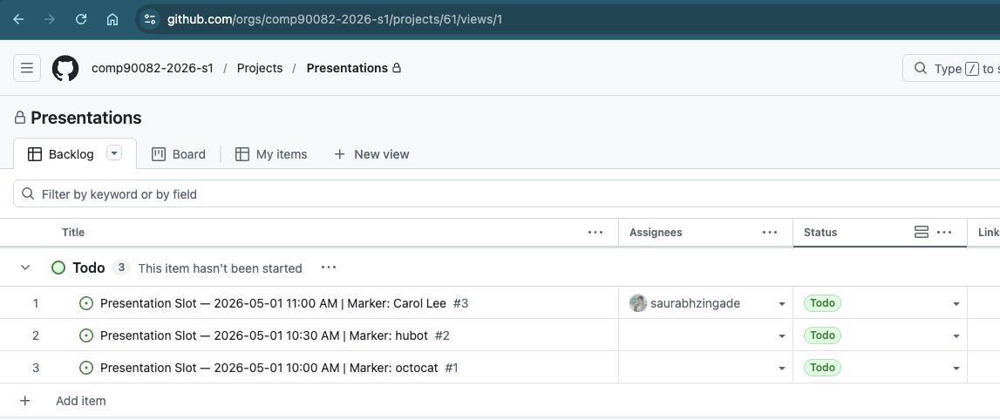
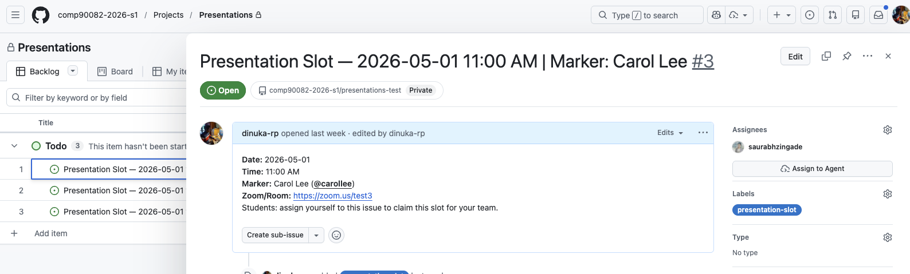
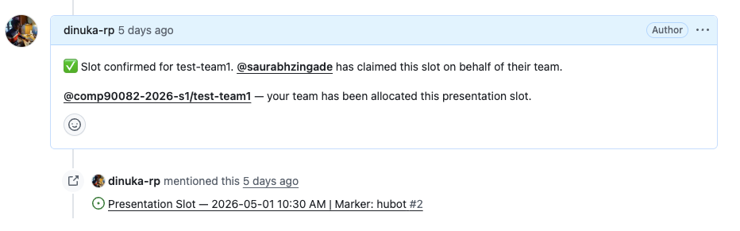
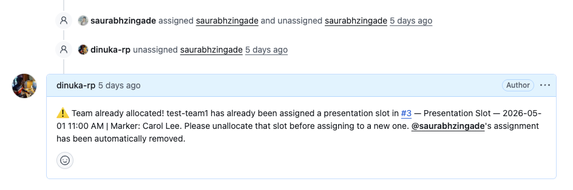

# Student Guide — Claiming a Presentation Slot

> **In a hurry?** Use the [one-page cheatsheet](student-cheatsheet.md). This guide is the full walkthrough with screenshots and troubleshooting.

Your team will present to a marker (a tutor from another team) during the scheduled presentation window. Each slot is a GitHub **issue** in this repo, and you claim one by assigning yourself to it. A bot checks every assignment against a few rules and either confirms your booking or removes it with an explanation.

**Only one person per team needs to claim a slot.** Once any teammate is assigned, the whole team is booked.

---

## Before you start

- You need a GitHub account and must be added to your team inside the `comp90082-2026-s1` org. If you can't see private team resources or the project board, let teaching staff know.
- You need to be signed in to GitHub in your browser.
- You'll receive an email for any comment on an issue you're assigned to — keep an eye out for it right after you self-assign.

---

## Step-by-step

### 1. Open the project board

Go to **[Project #61](https://github.com/orgs/comp90082-2026-s1/projects/61)**. Each row is a presentation slot with its date, time, marker, and location.

> **Tip:** If you'd rather work from the Issues tab, the filter `is:open label:presentation-slot no:assignee` shows only slots that are still free.

### 2. Find an unassigned slot

An unassigned slot has no avatar in the **Assignees** column. Pick one that:

- Works for your whole team, and
- Is **not** marked by your own team's mentor (the bot will reject it if you try).

Click the row to open the issue.

### 3. Assign yourself

On the issue page, in the **right sidebar**, find the **Assignees** section. Click **assign yourself** (or click the ⚙️ gear and tick your own name).

### 4. Wait for the bot to respond (15–30 seconds)

The validation runs in GitHub Actions, so there's a short delay. Refresh the issue page after ~20 seconds if nothing shows up yet. You'll also get an email notification with the result.

A ✅ comment means you're booked. A ⚠️ comment means the assignment was removed — see below.

---

## The rules (what the bot checks)

Every time someone assigns themselves, the bot runs four checks **in order** and stops at the first failure:

1. **Single assignee** — one person per slot. If someone was already assigned, yours is removed.
2. **Team membership** — you must be in a team inside the org. Otherwise the assignment is removed.
3. **No self-marking** — if the slot's marker is your own team's mentor, the assignment is removed.
4. **No double-booking** — if your team already holds another open slot, the assignment is removed.

Full technical spec: [docs/workflow-checks.md](workflow-checks.md).

---

## What the four rejection messages mean

### ⚠️ "Only one person can be assigned to a presentation slot at a time"

Someone else was already assigned when you tried. That person is named in the comment.

- If it's **a teammate**, you're booked — they claimed the slot for your team. Nothing more to do.
- If it's **not a teammate**, pick a different slot.

### ⚠️ "Assignment rejected. @… is not a member of any registered team"

Your GitHub account isn't in any team inside the org yet.

- Contact teaching staff to be added to your org team, then try again.

### ⚠️ "Self-marking rejected"

This slot is being marked by your own team's mentor. Teams don't get marked by their own mentor, so the bot blocks this.

- Pick any slot marked by a different tutor.

### ⚠️ "Team already allocated"

One of your teammates has already claimed a different slot for your team. The comment names that other issue.

- If your team is happy with the slot you already hold, do nothing.
- If you want to move: go to the other issue, **unassign** from it first, then come back and claim this one. The bot will not let you hold two slots at once.

---

## Changing or releasing your slot

To give up a slot, open the issue, and in the **Assignees** sidebar, remove yourself. The slot becomes free immediately — anyone (including your teammates) can claim it, so act quickly if you want to re-claim.

You **cannot** move to a new slot without releasing the old one first; the double-booking check will block you.

---

## FAQ

**My teammate assigned themselves — am I booked?**
Yes. One person per team is enough. The bot's ✅ comment will @-mention the whole team.

**I assigned myself and nothing happened after a minute.**
Refresh the page. If there's still no comment after ~2 minutes, the validation bot may be having trouble — contact teaching staff with the issue URL.

**I'm in two teams — which one gets booked?**
The bot checks **all** teams you belong to for every rule (so you can't bypass self-marking or double-booking via a secondary team). The confirmation message names one team; that's fine — your booking stands.

**Can I claim a slot marked by a different team's mentor?**
Yes — that's the normal case. The only rule is that you can't be marked by *your own* team's mentor.

**Can I unassign someone else?**
Don't. If someone is on the wrong slot, ask them to unassign themselves, or contact teaching staff.

---

## Stuck?

Contact Michael or the teaching team via Ed Discussion / email. Include the issue URL so we can see what happened.
