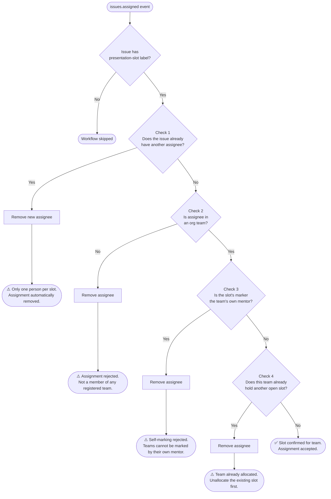

# GitHub Actions Workflow — Validation Checks

Every time a user is assigned to a `presentation-slot` issue, the workflow runs the following checks in order. The first failure removes the assignee and posts a comment explaining why.

## Flowchart

---

## Check 1 — Single assignee

**Question:** Does the issue already have another assignee?

- The `issues.assigned` payload's `issue.assignees` reflects state *after* the new assignment. If it contains any login other than the one just added, someone else was already assigned.
- Only one person per slot, no matter which team they belong to.
- **Pass:** no prior assignee → continue.
- **Fail → removes new assignee, comments:**
  > ⚠️ Only one person can be assigned to a presentation slot at a time. @{existing} has already claimed this slot. @{handle}'s assignment has been automatically removed.

---

## Check 2 — Team membership

**Question:** Is the assignee a member of any org team?

- Fetches all teams in the org and checks membership for the assignee against each one.
- **Pass:** team found → continue to next check.
- **Fail → removes assignee, comments:**
  > ⚠️ Assignment rejected. @{handle} is not a member of any registered team in this org. Only student team members can claim a presentation slot.

---

## Check 3 — Self-marking prevention

**Question:** Is this slot's marker the assignee's team's own mentor?

- Reads `data/teams.csv` to find the claiming team's mentor GitHub handle (e.g. `test-team1` → `octocat`).
- Reads `<!-- marker-handle: ... -->` from the issue body to get the slot's assigned marker handle.
- If they match, the team would be marked by their own mentor — not allowed.
- **Pass:** mentor ≠ marker → continue to next check.
- **Fail → removes assignee, comments:**
  > ⚠️ Self-marking rejected. @{handle}'s team (test-team1) is mentored by @octocat, who is the marker for this slot. Teams cannot be marked by their own mentor.

---

## Check 4 — Double-booking

**Question:** Does the claiming team already hold another open slot?

- Fetches all open `presentation-slot` issues.
- For each other issue that has assignees, resolves which team those assignees belong to.
- If any match the claiming team, they already have a slot booked.
- **Pass:** no other slot held → continue.
- **Fail → removes assignee, comments:**
  > ⚠️ Team already allocated! test-team1 has already been assigned a presentation slot in #2 — …. Please unallocate that slot before assigning to a new one. @{handle}'s assignment has been automatically removed.

---

## All clear

If all four checks pass, the slot is confirmed:

> ✅ Slot confirmed for test-team1. @{handle} has claimed this slot on behalf of their team.
