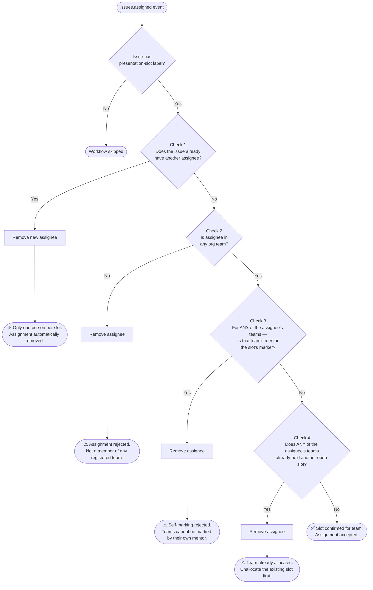

# GitHub Actions Workflow — Validation Checks

Every time a user is assigned to a `presentation-slot` issue, the workflow runs the following checks in order. The first failure removes the assignee and posts a comment explaining why.

> **Note on multi-team membership:** Checks 3 and 4 evaluate the assignee against **all** org teams they belong to, not just the first one. This ensures correct behaviour even if a user is a member of more than one team.

## Flowchart

---

## Check 1 — Single assignee

**Question:** Does the issue already have another assignee?

- The `issues.assigned` payload's `issue.assignees` reflects state *after* the new assignment. If it contains any login other than the one just added, someone else was already assigned.
- Only one person per slot, no matter which team they belong to.
- **Pass:** no prior assignee → continue.
- **Fail → removes new assignee, comments:**
  > ⚠️ Only one person can be assigned to a presentation slot at a time. @{existing} has already claimed this slot. @{handle}'s assignment has been automatically removed.

---

## Check 2 — Team membership

**Question:** Is the assignee a member of any org team?

- Fetches all teams in the org and checks membership for the assignee against each one.
- All matching teams are collected and carried forward into subsequent checks.
- **Pass:** at least one team found → continue.
- **Fail → removes assignee, comments:**
  > ⚠️ Assignment rejected. @{handle} is not a member of any registered team in this org. Only student team members can claim a presentation slot.

---

## Check 3 — Self-marking prevention

**Question:** For any of the assignee's teams, is that team's mentor the slot's marker?

- Reads `data/teams.csv` to look up the mentor GitHub handle for **each** team the assignee belongs to.
- Reads `<!-- marker-handle: ... -->` from the issue body to get the slot's marker handle.
- If the mentor of **any** of the assignee's teams matches the marker, the assignment is rejected. This prevents the check from being bypassed by a user who belongs to multiple teams.
- **Pass:** no team's mentor matches the marker → continue.
- **Fail → removes assignee, comments:**
  > ⚠️ Self-marking rejected. @{handle}'s team ({team}) is mentored by @{mentor}, who is the marker for this slot. Teams cannot be marked by their own mentor.

---

## Check 4 — Double-booking

**Question:** Does any of the assignee's teams already hold another open slot?

- Fetches all open `presentation-slot` issues.
- For each other issue that has an assignee, resolves all teams that assignee belongs to.
- Compares against all teams the new assignee belongs to — a collision on **any** shared team triggers rejection.
- **Pass:** no overlapping team holds another slot → continue.
- **Fail → removes assignee, comments:**
  > ⚠️ Team already allocated! {team} has already been assigned a presentation slot in #{number} — {title}. Please unallocate that slot before assigning to a new one. @{handle}'s assignment has been automatically removed.

---

## All clear

If all four checks pass, the slot is confirmed:

> ✅ Slot confirmed for {team(s)}. @{handle} has claimed this slot on behalf of their team.
